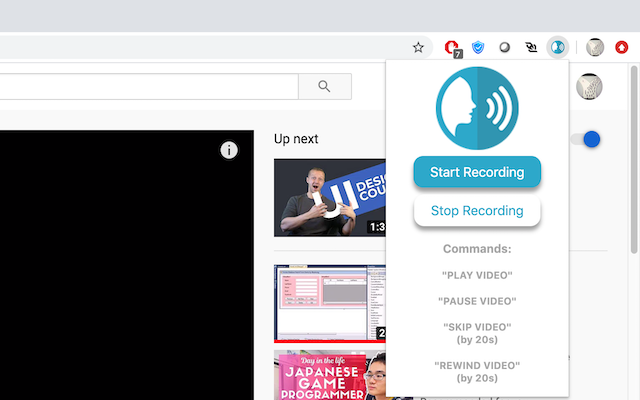

## What it is
A Chrome extension to control Netflix and YouTube videos with your voice.

  

To use it, press Start Recording from the pop up (or ctrl/cmd + E) and say the any of the following commands:

"Play Video"  
"Pause Video"  
"Skip Video"  
"Rewind Video" 
